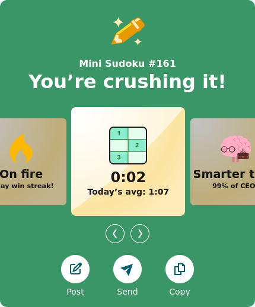
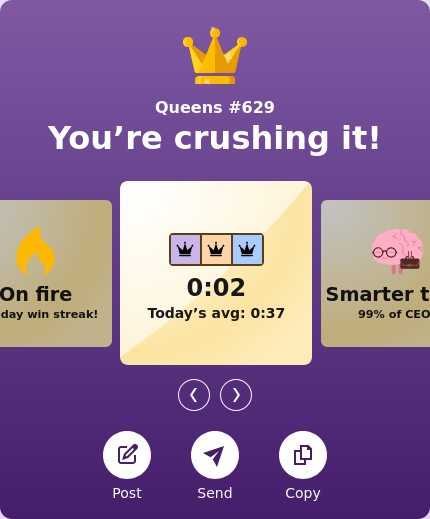
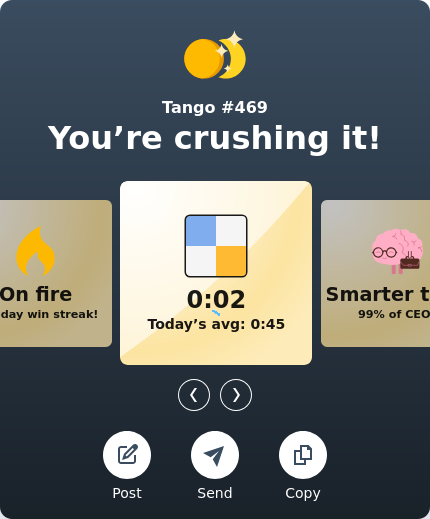
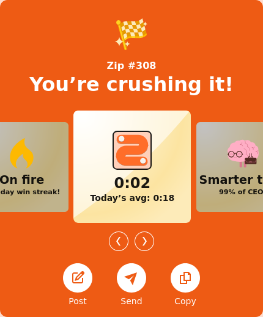

# LinkedIn Games Warp

This browser userscript makes LinkedIn games always register a 2-second completion time. Top of your connection leaderboard guaranteed.

Supported games
- Zip
- Mini Sudoku
- Tango
- Queens

## Installation

1. Install a userscript manager extension for your browser (for example [Tampermonkey](https://www.tampermonkey.net/) or [Violentmonkey](https://violentmonkey.github.io/)). Firefox is recommended.
2. Visit this script's page on Greasy Fork: [LinkedIn Games Warp on Greasy Fork](https://greasyfork.org/en/scripts/563230-linkedin-games-warp)
3. Click "Install". Your userscript manager should open - confirm the installation in the manager's dialog.

That's it. Open any of the supported games, solve it, and your time will display as two seconds. The 2-second value is applied server-side (and submitted), not only rendered in your browser UI.

| Mini Sudoku                                  | Queens                             |
|---------------------------------------------:|:-----------------------------------|
|  |  |

| Tango                                        | Zip                                |
|---------------------------------------------:|:-----------------------------------|
|              |        |
